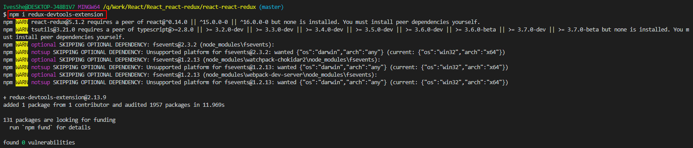

# react-redux

react-redux是facebook官方出的插件庫

本項目是基於這版本修改的

https://github.com/IvesShe/React_Redux

# Github展示

https://ivesshe.github.io/React_react-redux/


# react-redux模型圖


# 創建項目

```bash
create-react-app react-react-redux
```


# 簡化檔案結構

創建完成之後，刪除不要的檔案

最後只留四個檔案

詳細可參考之前項目

https://github.com/IvesShe/React_Router

# 安裝react-redux

```bash
npm i react-redux
```

不知道為何安裝一直失敗，加了--save也一樣

後來google查到直接改package.json

直接增加

"react-redux": "^5"

```json
"dependencies": {
    "react-redux": "^5"
  },
```

執行

```bash
npm i
```


# 求和案例_react-redux基本使用

1. 明確兩個概念：
    - UI組件：不能使用任何redux的api，只負責頁面的呈現、交互等
    - 容器組件：負責和redux通信，將結果交給UI組件

2. 如何創建一個容器組件 - 靠react-redux的connect函數
```jsx
connect(mapStateToProps,mapDispatchToProps)(UI組件)
    - mapStateToProps: 映射狀態，返回值是一個對象
    - mapDispatchToProps: 映射操作狀態的方法，返回值是一個對象
```

3. 備註1：容器組件中的store是靠props傳進去的，而不是在容器組件中直接引用

4. 備註2：mapDispatchToProps，也可以是一個對象

# 求和案例_react-redux優化

1. 容器組件和UI組件整合成一個文件

2. 無需自己給容器組件傳遞store
```jsx
給<App/>包裏一個<Provider store={store}>即可
```

3. 使用react-redux後也不用再自己檢測redux中狀態的改變了，容器組件可以自動完成這工作

4. mapDispatchToProps也可以簡單的寫成一個對象

5. 一個組件要和redux"打交道"要經過的步驟
    - 定義好UI組件 --- 不暴露
    - 引入connect生成一個容器組件，並暴露，寫法如下：
    ```jsx
    connect(
        state=>({key:value}),   // 映射狀態
        {key:xxxxAction}        // 映射操作狀態的方法
    )(UI組件)
    ```
    - 在UI組件中通過this.props.xxxxx讀取和操作狀態

# 安裝nanoid    

```bash
npm i nanoid
```


# 求和案例_react-redux數據共享版

1. 定義一個Person組件，和Count組件通過redux共享數據
2. 為Person組件編寫：reducer、action，配置constant常量
3. 重點：Person的reducer和Count的Reducer要使用cobineReducers進行合併，合併後的總狀態是一個對象
4. 交給store的是總reducer，最後注意在組件中取出狀態的時候，記得"取到位"

# 純函數 和 高階函數

## 純函數

1. 一個特別的函數：只要是同樣的輸入(實參)，必定得到同樣的輸出(返回)

2. 必須遵守以下一些約束
    - 不得改寫參數數據
    - 不會產生任何副作用，例如網絡請求，輸入和輸出設備
    - 不能調用Date.now()或者Math.random()等不純的方法

3. redux和reducer函數必須是一個純函數

## 高階函數

1. 理解：一類特別的函數
    - 情況1：參數是函數
    - 情況2：返回是函數

2. 常見的高階函數：
    - 定時器設置函數
    - 數組的forEach()/map()/filter()/reduce()/find()/bind()
    - promise
    - react-redux中的connect函數

3. 作用：能實現更加動態、更加可擴展的功能    

# 安裝開發工具 Redux DevTools



安裝完之後，還要安裝對應的依賴庫

## 安裝 redux-devtools-extension

```bash
npm i redux-devtools-extension
```


## 修改store.js

引用

```js
// 引用redux-devtools-extension
import {composeWithDevTools} from 'redux-devtools-extension'

export default createStore(allReducer,composeWithDevTools(applyMiddleware(thunk)))
```

## 可以使用了


# 求和案例_react-redux最終版

1. 所有變量名字要規範，盡量觸發對象的簡稱形式
2. reducers文件夾中，編寫index.js專門用於匯總並暴露所有的reducer

# 執行畫面


# Github上傳
可以參考之前的文檔

https://github.com/IvesShe/React_TodoList